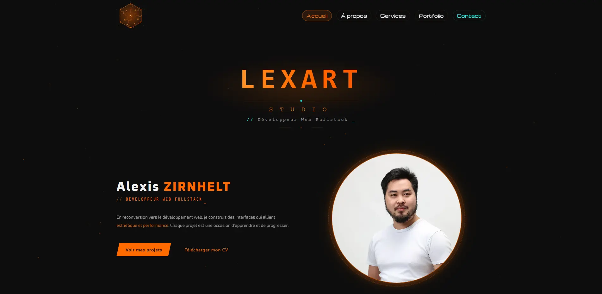

# Lexart Studio — Portfolio



Portfolio personnel d'Alexis Zirnhelt, développeur web fullstack en formation à Nancy.  
Design cyberpunk orange, animations canvas, formulaire de contact intégré.

---

## Technologies

| Catégorie | Outils |
|-----------|--------|
| Framework | React 19 + React Router DOM 7 |
| Build | Vite 8 |
| CSS | Bootstrap 5 + CSS custom (variables, animations) |
| Contact | EmailJS |
| Optimisation | PurgeCSS, lazy routes, images WebP |

---

## Pages

| Route | Description |
|-------|-------------|
| `/` | Accueil — photo, présentation, CTA |
| `/about` | À propos — stats, timeline, compétences |
| `/services` | Services proposés (6 cartes) |
| `/portfolio` | Projets réalisés (flip cards) |
| `/contact` | Formulaire de contact via EmailJS |
| `/mentions-legales` | Mentions légales |
| `/politique-de-confidentialite` | Politique de confidentialité |

---

## Installation

```bash
npm install
npm run dev
```

## Scripts

```bash
npm run dev      # Serveur de développement (réseau exposé)
npm run build    # Build de production
npm run preview  # Prévisualisation du build
npm run lint     # Analyse ESLint
```

---

## Structure

```
src/
├── pages/          # 7 pages (lazy-loadées)
├── components/
│   ├── layout/     # Header, Footer
│   └── ui/         # CardPortfolio, CardServices, LegalPanel...
├── hooks/          # useParticles, useClock, useLegalPage
├── data/           # portfolio.js, services.js, about.js
├── styles/         # CSS par composant + variables.css
└── assets/         # Images WebP, SVG
```

---

## Fonctionnalités

- Animations canvas (particules connectées)
- Cartes portfolio avec effet flip 3D
- Formulaire de contact avec gestion des états (envoi / erreur)
- Accordéon pour les pages légales
- Design responsive mobile-first
- Réduction des animations (`prefers-reduced-motion`)
- Error boundary React
